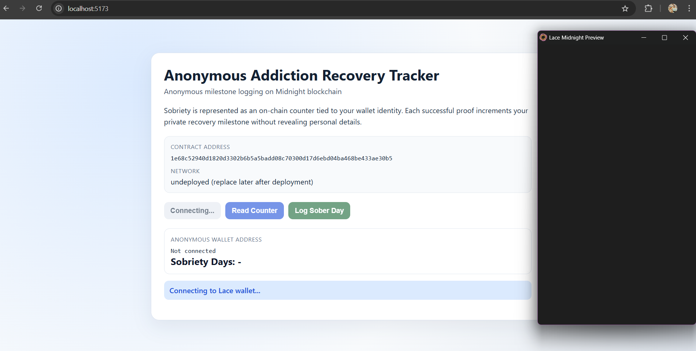

# Anonymous Addiction Recovery Tracker 🛡️
> **Privacy-preserving sobriety tracking on the Midnight Network.**
This project allows individuals to track their recovery progress and prove their sobriety milestones without ever revealing their identity or the exact duration of their sobriety to the public. Built on **Midnight**, it leverages Zero-Knowledge Proofs (ZKPs) to verify claims (e.g., "I have been sober for more than 30 days") while keeping the underlying data private.
---
## 🌟 What it does
The **Anonymous Addiction Recovery Tracker** solves the dilemma of needing community support/verification while maintaining strict privacy. 
- **Private State**: Users maintain their sobriety start date and current streak in a private data store.
- **Public Verification**: Users can generate a proof that their streak meets a community or personal threshold (e.g., 30 days, 6 months) without revealing the specific date.
- **Trustless**: The smart contract verifies the ZK proof on-chain, incrementing a public counter of "verified recoveries" only if the proof is valid.
## ✨ Features
- **🛡️ Zero-Knowledge Privacy**: Your sobriety date and exact day count never leave your device.
- **✅ Threshold Verification**: Prove you've met a milestone (e.g., > 30 days) with a simple boolean verification.
- **❌ Sybil Resistance**: (Planned) Nullifiers ensure one person cannot spam verify the same milestone.
- **📊 Community Stats**: Publicly visible counter of total verified milestones facilitates community motivation.
## 🚀 Deployed Smart Contract
**Network**: Midnight Testnet / Local (Undeployed)  
**Contract Address**: `1e68c52940d1820d3302b6b5a5badd08c70300d17d6ebd04ba468be433ae30b5`  
*(Note: Check `counter-contract/deployment.json` for the most recent deployment address)*
---
## 🛠️ Project Structure
- **`counter-contract`**: The Midnight compact smart contract (`addiction.compact`) and deployment scripts.
- **`counter-cli`**: Command-line interface for interacting with the contract.
- **`frontend-vite-react`**: (In Progress) Web dashboard for users.
## ⚡ Quick Start
### Prerequisites
- Node.js & npm
- Docker (for Midnight Compact compiler)
- Midnight Lace Wallet
### Installation
```bash
# Install dependencies
npm install
# Compile the contract (Requires Compact tools)
npm run compile:addiction -w counter-contract
# Deploy to local network
npm run deploy -w counter-contract
```
## 📜 Contract Logic (`addiction.compact`)
The contract defines a circuit `verify_streak` that:
1. Takes a private input `sober_days`.
2. Checks if `sober_days` >= `threshold` (public ledger state).
3. If valid, increments the `verified_count`.
---
<div align="center">
  <sub>Built with ❤️ on Midnight Network</sub>
</div>
## UI Screenshot

